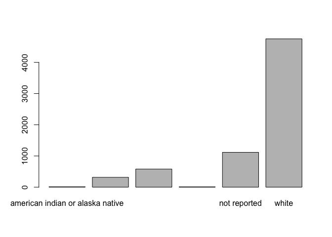

Introduction to R, Class 2: Working with data
================

<!--class2.md is generated from class2.Rmd. Please edit that file -->

## Objectives

In the last section, we learned some fundamental principles of R and how
to work in RStudio.

In this session, we’ll continue our introduction to R by working with a
large dataset that more closely resembles that which you may encounter
while analyzing data for research. By the end of this session, you
should be able to:

  - import spreadsheet-style data into R as a data frame
  - extract portions of data from a data frame
  - manipulate factors (categorical data)

## Importing spreadsheet-style data into R

Open RStudio, and we’ll check to make sure you’re ready to start work
again. You can check to see if you’re working in your project directory
by looking at the top of the Console. You should see the path (location
in your computer) for the project directory you created last time (e.g.,
`~/Desktop/intro_r`).

If you do not see the path to your project directory, go to `File ->
Open Project` and navigate to the location of your project directory.
Alternatively, using your operating system’s file browser, double click
on the `r_intro.Rrpoj` file.

Create a new R script (`File -> New File -> R Script`) and save it in
your project directory with the name `class2.R`. Place the following
comment on the top line as a title:

`# Introduction to R: Class 2`

In the last session, we recommended organizing your work in directories
(folders) according to projects. While a thorough discussion of project
organization is beyond the scope of this class, we will continue to
model best practices by creating a directory to hold our data:

``` r
# make a directory
dir.create("data")
```

You should see the new directory appear in your project directory, in
the lower right panel in RStudio. There is also a button in that panel
you can use to create a new folder, but including the code to perform
this task makes other people (and yourself) able to reproduce your work
more easily.

Now that we have a place to store our data, we can go ahead and download
the dataset:

``` r
# download data from url
download.file("https://raw.githubusercontent.com/fredhutchio/R_intro/master/extra/clinical.csv", "data/clinical.csv")
```

The code above has two arguments, both encompassed in quotation marks:
first, you indicate where the data can be found online. Second, you
indicate where R should store a copy of the file on your own computer.

The output from that command may look alarming, but it represents
information confirming it worked. You can click on the `data` folder to
ensure the file is now present.

Notice that the URL above ends in `clinical.csv`, which is also the name
we used to save the file on our computers. If you click on the URL and
view it in a web browser, the format isn’t particularly easy for us to
understand. You can also view the file by clicking on it in the lower
right hand panel, then selecting “View File.”

> The option to “Import Dataset” you see after clicking on the file
> references some additional tools present in RStudio that can assist
> with various kinds of data import. Because this requires installing
> additional software, complete exploration of these options is outside
> the scop of this class. For more information, check out [this
> article](https://support.rstudio.com/hc/en-us/articles/218611977-Importing-Data-with-RStudio).

The data we’ve downloaded are in csv format, which stands for “comma
separated values.” This means the data are organized into rows and
columns, with columns separated by commas.

These data are arranged in a tidy format, meaning each row represents an
observation, and each column represents a variable (piece of data for
each observation). Moreover, only one piece of data is entered in each
cell.

Now that the data are downloaded, we can import the data and assign to
an object:

``` r
# import data and assign to object
clinical <- read.csv("data/clinical.csv")
```

You should see `clinical` appear in the Environment window on the upper
right panel in RStudio. If you click on `clinical` there, a new tab will
appear next to your R script in the Source window.

> Clicking on the name of an object in the Environment window is a
> shortcut for running `View(clinical)`; you’ll see this code appear in
> the Console after clicking.

Now that we have the data imported and assigned to an object, we can
take some time to explore the data we’ll be using for the rest of this
course:

  - These data are clinical cancer data from the [National Cancer
    Institute’s Genomic Data Commons](https://gdc.cancer.gov),
    specifically from The Cancer Genome Atlas, or
    [TCGA](https://www.cancer.gov/about-nci/organization/ccg/research/structural-genomics/tcga).
  - Each row represents a patient, and each column represents
    information about demographics (race, age at diagnosis, etc) and
    disease (e.g., cancer type).
  - The data were downloaded and aggregated using an R script, which you
    can view in the [GitHub repository for this
    course](https://github.com/fredhutchio/R_intro/blob/master/0dataset.R).

The function we used to import the data is one of a family of commands
used to import the data. Check out the help documentation for `read.csv`
for more options for importing data.

> You can also import data directly into R using `read.csv`, using
> `clinical <-
> read.csv("https://raw.githubusercontent.com/fredhutchio/R_intro/master/extra/clinical.csv")`.
> For these lessons, we model downloading and importing in two steps, so
> you retain a copy of the data on your computer. This reflects how
> you’re likely to import your own data, as well as recommended
> practice for retaining data used in an analysis (since data online may
> be updated).

**Challenge:** Download, inspect, and import the following data files.
The URL for each sample dataset is included along with a name to assign
to the object. (Hint: you can use the same function as above, but may
need to update the `sep =` parameter)

  - URL:
    <https://raw.githubusercontent.com/fredhutchio/R_intro/master/extra/clinical.tsv>,
    object name: `example1`
  - URL:
    <https://raw.githubusercontent.com/fredhutchio/R_intro/master/extra/clinical.txt>,
    object name: `example2`

(solutions [here](solutions/class2_solutions.R))

Importing data can be tricky and frustrating, However, if you can’t get
your data into R, you can’t do anything to analyze or visualize it. It’s
worth understanding how to do it effectively to save you time and energy
later.

## Data frames

Now that we have data imported and available, we can start to inspect
the data more closely.

These data have been interpreted by R to be a data frame, which is a
data structure (way of organizing data) that is analogous to tabular or
spreadsheet style data. By definition, a data frame is a table made of
vectors (columns) of all the same length. As we learned in our last
session, a vector needs to include all of the same type of data (e.g.,
character, numeric). A data frame, however, can include vectors
(columns) of different data types.

To learn more about this data frame, we’ll first explore its dimensions:

``` r
# assess size of data frame
dim(clinical)
```

    ## [1] 6832   20

The output reflects the number of rows first (6832), then the number of
columns (20).

We can also preview the content by showing the first few rows:

``` r
# preview first few rows
head(clinical) 
```

    ##   primary_diagnosis tumor_stage age_at_diagnosis vital_status morphology
    ## 1             C34.1    stage ia            24477         dead     8070/3
    ## 2             C34.1    stage ib            26615         dead     8070/3
    ## 3             C34.3    stage ib            28171         dead     8070/3
    ## 4             C34.1    stage ia            27154        alive     8083/3
    ## 5             C34.3   stage iib            29827         dead     8070/3
    ## 6             C34.1  stage iiia            23370        alive     8070/3
    ##   days_to_death state tissue_or_organ_of_origin days_to_birth
    ## 1           371  live                     C34.1        -24477
    ## 2           136  live                     C34.1        -26615
    ## 3          2304  live                     C34.3        -28171
    ## 4            NA  live                     C34.1        -27154
    ## 5           146  live                     C34.3        -29827
    ## 6            NA  live                     C34.1        -23370
    ##   site_of_resection_or_biopsy days_to_last_follow_up cigarettes_per_day
    ## 1                       C34.1                     NA          10.958904
    ## 2                       C34.1                     NA           2.191781
    ## 3                       C34.3                   2099           1.643836
    ## 4                       C34.1                   3747           1.095890
    ## 5                       C34.3                     NA                 NA
    ## 6                       C34.1                   3576           2.739726
    ##   years_smoked gender year_of_birth         race              ethnicity
    ## 1           NA   male          1936        white not hispanic or latino
    ## 2           NA   male          1931        asian not hispanic or latino
    ## 3           NA female          1927        white not hispanic or latino
    ## 4           NA   male          1930        white not hispanic or latino
    ## 5           NA   male          1923 not reported           not reported
    ## 6           NA female          1942 not reported           not reported
    ##   year_of_death bcr_patient_barcode disease
    ## 1          2004        TCGA-18-3406    LUSC
    ## 2          2003        TCGA-18-3407    LUSC
    ## 3            NA        TCGA-18-3408    LUSC
    ## 4            NA        TCGA-18-3409    LUSC
    ## 5          2004        TCGA-18-3410    LUSC
    ## 6            NA        TCGA-18-3411    LUSC

The default number of rows shown is six. You can specify a different
number using the `n =` parameter, demonstrated below using `tail`, which
shows the last few rows

``` r
# show last three rows
tail(clinical, n = 3) 
```

    ##      primary_diagnosis  tumor_stage age_at_diagnosis vital_status morphology
    ## 6830             C54.1 not reported            27326         dead     8950/3
    ## 6831             C54.1 not reported            24781        alive     8950/3
    ## 6832             C54.1 not reported            20318        alive     8950/3
    ##      days_to_death state tissue_or_organ_of_origin days_to_birth
    ## 6830           949  live                     C54.1        -27326
    ## 6831            NA  live                     C54.1        -24781
    ## 6832            NA  live                     C54.1        -20318
    ##      site_of_resection_or_biopsy days_to_last_follow_up cigarettes_per_day
    ## 6830                       C54.1                     NA                 NA
    ## 6831                       C54.1                    587                 NA
    ## 6832                       C54.1                      0                 NA
    ##      years_smoked gender year_of_birth  race              ethnicity
    ## 6830           NA female          1932 white not hispanic or latino
    ## 6831           NA female          1945 white not hispanic or latino
    ## 6832           NA female          1957 asian not hispanic or latino
    ##      year_of_death bcr_patient_barcode disease
    ## 6830          2008        TCGA-NG-A4VW     UCS
    ## 6831            NA        TCGA-QM-A5NM     UCS
    ## 6832            NA        TCGA-QN-A5NN     UCS

We often need to reference the names of columns, so it’s useful to print
only those to the screen:

``` r
# view column names
names(clinical) 
```

    ##  [1] "primary_diagnosis"           "tumor_stage"                
    ##  [3] "age_at_diagnosis"            "vital_status"               
    ##  [5] "morphology"                  "days_to_death"              
    ##  [7] "state"                       "tissue_or_organ_of_origin"  
    ##  [9] "days_to_birth"               "site_of_resection_or_biopsy"
    ## [11] "days_to_last_follow_up"      "cigarettes_per_day"         
    ## [13] "years_smoked"                "gender"                     
    ## [15] "year_of_birth"               "race"                       
    ## [17] "ethnicity"                   "year_of_death"              
    ## [19] "bcr_patient_barcode"         "disease"

It’s also possible to view row names using`rownames(clinical)`, but our
data only possess numbers for row names so it’s not very informative.

As we learned last time, we can use `str` to provide a general overview
of the object:

``` r
# show overview of object
str(clinical) 
```

    ## 'data.frame':    6832 obs. of  20 variables:
    ##  $ primary_diagnosis          : Factor w/ 103 levels "C07","C16.0",..: 21 21 24 21 24 21 24 24 21 21 ...
    ##  $ tumor_stage                : Factor w/ 18 levels "i/ii nos","not reported",..: 5 6 6 5 9 12 6 15 6 9 ...
    ##  $ age_at_diagnosis           : int  24477 26615 28171 27154 29827 23370 19025 26938 28430 30435 ...
    ##  $ vital_status               : Factor w/ 3 levels "alive","dead",..: 2 2 2 1 2 1 2 2 2 2 ...
    ##  $ morphology                 : Factor w/ 83 levels "8010/3","8013/3",..: 7 7 7 11 7 7 7 7 7 7 ...
    ##  $ days_to_death              : int  371 136 2304 NA 146 NA 345 716 2803 973 ...
    ##  $ state                      : Factor w/ 1 level "live": 1 1 1 1 1 1 1 1 1 1 ...
    ##  $ tissue_or_organ_of_origin  : Factor w/ 94 levels "C07.9","C16.0",..: 23 23 25 23 25 23 25 25 23 23 ...
    ##  $ days_to_birth              : int  -24477 -26615 -28171 -27154 -29827 -23370 -19025 -26938 -28430 -30435 ...
    ##  $ site_of_resection_or_biopsy: Factor w/ 94 levels "C07.9","C16.0",..: 23 23 25 23 25 23 25 25 23 23 ...
    ##  $ days_to_last_follow_up     : int  NA NA 2099 3747 NA 3576 NA NA 1810 956 ...
    ##  $ cigarettes_per_day         : num  10.96 2.19 1.64 1.1 NA ...
    ##  $ years_smoked               : int  NA NA NA NA NA NA NA NA NA NA ...
    ##  $ gender                     : Factor w/ 2 levels "female","male": 2 2 1 2 2 1 2 2 2 2 ...
    ##  $ year_of_birth              : int  1936 1931 1927 1930 1923 1942 1953 1932 1929 1923 ...
    ##  $ race                       : Factor w/ 6 levels "american indian or alaska native",..: 6 2 6 6 5 5 6 2 5 5 ...
    ##  $ ethnicity                  : Factor w/ 3 levels "hispanic or latino",..: 2 2 2 2 3 3 2 2 3 3 ...
    ##  $ year_of_death              : int  2004 2003 NA NA 2004 NA 2005 2006 NA NA ...
    ##  $ bcr_patient_barcode        : Factor w/ 6289 levels "TCGA-02-0001",..: 414 415 416 417 418 419 420 421 422 423 ...
    ##  $ disease                    : Factor w/ 15 levels "BLCA","BRCA",..: 7 7 7 7 7 7 7 7 7 7 ...

The output provided includes:

  - data structure: data frame
  - dimensions: 6832 rows and 20 columns
  - column-by-column information: each prefaced with a `$`, and includes
    the column name, data type (num, int, Factor)

> Factors are how character data are interpreted by R in data frames.
> We’ll talk more about working with factors at the end of this
> lesson.

Finally, we can also examine basic summary statistics for each column:

``` r
# provide summary statistics for each column
summary(clinical) 
```

    ##  primary_diagnosis       tumor_stage   age_at_diagnosis       vital_status 
    ##  C50.9  :1087      not reported:2753   Min.   : 3982    alive       :4586  
    ##  C71.9  : 652      stage iia   : 724   1st Qu.:19191    dead        :2205  
    ##  C54.1  : 568      stage iib   : 543   Median :22842    not reported:   2  
    ##  C34.1  : 523      stage iiia  : 391   Mean   :22320    NA's        :  39  
    ##  C61    : 499      stage ib    : 382   3rd Qu.:26002                       
    ##  (Other):3464      (Other)     :2000   Max.   :32872                       
    ##  NA's   :  39      NA's        :  39   NA's   :114                         
    ##    morphology   days_to_death      state      tissue_or_organ_of_origin
    ##  8070/3 :1108   Min.   :    0.0   live:6793   C50.9  :1088             
    ##  8140/3 : 996   1st Qu.:  274.0   NA's:  39   C71.9  : 652             
    ##  8500/3 : 787   Median :  524.0               C54.1  : 568             
    ##  9440/3 : 596   Mean   :  878.2               C34.1  : 525             
    ##  8720/3 : 420   3rd Qu.: 1044.5               C61.9  : 500             
    ##  (Other):2886   Max.   :10870.0               (Other):3460             
    ##  NA's   :  39   NA's   :4645                  NA's   :  39             
    ##  days_to_birth    site_of_resection_or_biopsy days_to_last_follow_up
    ##  Min.   :-32872   C50.9  :1088                Min.   :  -64.0       
    ##  1st Qu.:-26002   C71.9  : 652                1st Qu.:  345.0       
    ##  Median :-22842   C54.1  : 568                Median :  650.0       
    ##  Mean   :-22320   C34.1  : 525                Mean   :  976.8       
    ##  3rd Qu.:-19191   C61.9  : 500                3rd Qu.: 1259.0       
    ##  Max.   : -3982   (Other):3460                Max.   :11252.0       
    ##  NA's   :114      NA's   :  39                NA's   :1118          
    ##  cigarettes_per_day  years_smoked      gender     year_of_birth 
    ##  Min.   : 0.008     Min.   : 8.00   female:3535   Min.   :1902  
    ##  1st Qu.: 1.370     1st Qu.:30.75   male  :3258   1st Qu.:1937  
    ##  Median : 2.192     Median :40.00   NA's  :  39   Median :1947  
    ##  Mean   : 2.599     Mean   :39.96                 Mean   :1948  
    ##  3rd Qu.: 3.288     3rd Qu.:50.00                 3rd Qu.:1957  
    ##  Max.   :40.000     Max.   :63.00                 Max.   :1993  
    ##  NA's   :5661       NA's   :6384                  NA's   :170   
    ##                                         race                       ethnicity   
    ##  american indian or alaska native         :  15   hispanic or latino    : 180  
    ##  asian                                    : 316   not hispanic or latino:4866  
    ##  black or african american                : 581   not reported          :1747  
    ##  native hawaiian or other pacific islander:  12   NA's                  :  39  
    ##  not reported                             :1116                                
    ##  white                                    :4753                                
    ##  NA's                                     :  39                                
    ##  year_of_death    bcr_patient_barcode    disease    
    ##  Min.   :1990   TCGA-18-3406:   2     BRCA   :1098  
    ##  1st Qu.:2004   TCGA-18-3407:   2     LUSC   :1008  
    ##  Median :2007   TCGA-18-3408:   2     GBM    : 617  
    ##  Mean   :2006   TCGA-18-3409:   2     UCEC   : 560  
    ##  3rd Qu.:2010   TCGA-18-3410:   2     LGG    : 516  
    ##  Max.   :2014   (Other)     :6783     PRAD   : 500  
    ##  NA's   :5266   NA's        :  39     (Other):2533

For numeric data (such as `year_of_death`), this output includes common
statistics like median and mean, as well as the number of rows
(patients) with missing data (as `NA`). For factors (character data,
such as `disease`), you’re given a count of the number of times the top
six most frequent factors (categories) occur in the data frame.

## Subsetting data frames

Now that our data are available for use, we can begin extracting
relevant information from them.

``` r
# extract first column and assign to a variable
first_column <- clinical[1]
```

As discussed last time with vectors, the square brackets (`[ ]`) are
used to subset, or reference part of, a data frame. You can inspect the
output object by clicking on it in the environment. It contains all of
the rows for only the first column.

When a single number is included in the square brackets, R assumes you
are referencing a column. When you include two numbers in square
brackets separated by a comma, R assumes the **first number references
the row** and the **second number references the column** you desire.

This means you can also reference the first column as follows:

``` r
# extract first column
first_column_again <- clinical[ , 1]
```

Leaving one field blank means you want the entire set in the output (in
this case, all rows).

**Challenge:** what is the difference in results between the last two
lines of code? (solutions [here](solutions/class2_solutions.R))

Similarly, we can also extract only the first row across all columns:

``` r
# extract first row 
first_row <- clinical[1, ]
```

We can also extract slices, or sections of rows and columns, such as a
single cell:

``` r
# extract cell from first row of first column
single_cell <- clinical[1,1]
```

To extract a range of cells, we use the same colon (`:`) syntax from
last time:

``` r
# extract a range of cells, rows 1 to 3, second column
range_cells <- clinical[1:3, 2]
```

This works for ranges of columns as well.

We can also exclude particular parts of the dataset using a minus sign:

``` r
# exclude first column
exclude_col <- clinical[ , -1] 
```

Combining what we know about R syntax, we can also exclude a range of
cells using the `c` function:

``` r
# exclude first 100 rows
exclude_range <- clinical[-c(1:100), ] 
```

So far, we’ve been referencing parts of the dataset based on index
position, or the number of row/column. Because we have included column
names in our dataset, we can also reference columns using those names:

``` r
# extract column by name
name_col1 <- clinical["tumor_stage"]
name_col2 <- clinical[ , "tumor_stage"]
```

Note the example above features quotation marks around the column name.
Without the quotation marks, R will assume we’re attempting to reference
an object.

As we discussed with subsetting based on index above, the two objects
created above differ in the data structure. `name_col1` is a data frame
(with one column), while `name_col2` is a vector. Although this
difference in the type of object may not matter for your analysis, it’s
useful to understand that there are multiple ways to accomplish a task,
each of which may make particular code work more easily.

There are additional ways to extract columns, which use R specific for
complex data objects, and may be useful to recognize as your R skills
progress.

The first is to use double square brackets:

``` r
# double square brackets syntax
name_col3 <- clinical[["tumor_stage"]]
```

You can think of this approach as digging deeply into a complex object
to retrieve data.

The final approach is equivalent to the last example, but can be
considered a shortcut since it requires fewer keystrokes (no quotation
marks, and only one symbol):

``` r
# dollar sign syntax
name_col4 <- clinical$tumor_stage
```

Both of the last two approaches above return vectors. For more
information about these different ways of accessing parts of a data
frame, see [this
article](https://www.r-bloggers.com/r-accessors-explained/).

The following challenges all use the `clinical` object:

**Challenge:** code as many different ways possible to extract the
column days\_to\_death (solutions [here](solutions/class2_solutions.R))

**Challenge:** extract the first 6 rows for only age at diagnosis and
days to death (solutions [here](solutions/class2_solutions.R))

**Challenge:** calculate the range and mean for cigarettes per day
(solutions [here](solutions/class2_solutions.R))

## Factors

This section explores one of the trickier types of data you’re likely to
encounter: factors, which are how R interprets categorical data.

When we imported our dataset into R, the `read.csv` function
automatically assumed that all the character data in our dataset are
factors, or categories. Factors have predefined sets of values, called
levels. We can explore what this means by first creating a factor
vector:

``` r
# create vector with factor data
test_data <- factor(c("placebo", "test_drug", "placebo", "known_drug"))
# show factor
test_data
```

    ## [1] placebo    test_drug  placebo    known_drug
    ## Levels: known_drug placebo test_drug

This vector includes four pieces of data (often referred to as items or
elements), which are printed as output above. The second line of the
output shows information about the levels, or categories, of our vector.
We can also access this information separately, which is useful if the
data (vector) has a large number of elements:

``` r
# show levels of factor
levels(test_data) 
```

    ## [1] "known_drug" "placebo"    "test_drug"

The levels in this test dataset are currently listed in alphabetical
order, which is the default presentation in R. The order of factors
dictates how they are presented in subsequent analyses, so there are
definitely cases in which you may want the levels in a specific order.
In the case of `test_data`, we may want to keep the two drug treatments
together, with placebo at the end:

``` r
# reorder factors to put placebo at end
test_data <- factor(test_data, levels = c("known_drug", "test_drug", "placebo"))
# show reordered
test_data
```

    ## [1] placebo    test_drug  placebo    known_drug
    ## Levels: known_drug test_drug placebo

This doesn’t change the data itself, but does make it easier to manage
the data later.

Another useful aspect of factors is that they are stored as integers
with labels. This means that you can easily convert them to numeric
data:

``` r
# converting factors to numeric
as.numeric(test_data)
```

    ## [1] 3 2 3 1

This can be handy for some types of statistical analyses, and also
illustrates the importance of ordering your levels appropriately.

We can apply this knowledge to our clinical dataset, by first observing
how the data are presented when creating a basic plot:

``` r
# quick and dirty plot
plot(clinical$race) 
```

<!-- -->

The labels as presented by default are not particularly readable, and
also lack appropriate capitalization and formatting. While it is
possible to modify only the plot labels, we would have to do that for
all of our subsequent analyses. It is more efficient to modify the
levels once:

``` r
# assign race data to new object 
race <- clinical$race 
levels(race)
```

    ## [1] "american indian or alaska native"         
    ## [2] "asian"                                    
    ## [3] "black or african american"                
    ## [4] "native hawaiian or other pacific islander"
    ## [5] "not reported"                             
    ## [6] "white"

By assigning the data to a new object, we can more easily perform
manipulations without altering the original dataset.

The output above shows the current levels for race. We can access each
level using their position in this order, combined with our knowledge of
square brackets for subsetting:

``` r
levels(race)[1]
```

    ## [1] "american indian or alaska native"

We can modify them to improve their formatting by assigning a new level
(name) of our choosing:

``` r
# correct factor levels
levels(race)[1] <- "Am Indian"
levels(race)[2] <- "Asian" # capitalize asian
levels(race)[3] <- "black"
levels(race)[4] <- "Pac Isl"
levels(race)[5] <- "unknown"
# show revised levels
levels(race) 
```

    ## [1] "Am Indian" "Asian"     "black"     "Pac Isl"   "unknown"   "white"

Although we’re not doing so here, we could also reorder the levels (as
we did for `test_data`).

Once we are satisfied with the resulting levels, we assign the modified
factor back to the original dataset:

``` r
# replace race in data frame
clinical$race <- race
# replot with corrected names
plot(clinical$race)
```

<!-- -->

This section was a very brief introduction to factors, and it’s likely
you’ll need more information when working with categorical data of your
own. A good place to start would be [this
article](https://peerj.com/preprints/3163/), and exploring some of the
tools in the tidyverse (which we’ll discuss in the next lesson).

**Challenge:** In your clinical dataset, replace “not reported” in
ethnicity with NA (solutions [here](solutions/class2_solutions.R))

**Challenge:** What Google search helps you identify additional
strategies for renaming missing data? (solutions
[here](solutions/class2_solutions.R))

## Optional: Creating a data frame by hand

This last section shows two different approaches to creating a data
frame by hand (in other words, without importing the data from a
spreadsheet). It isn’t particularly useful for most of your day-to-day
work, and also not a method you want to use often, as this type of data
entry can introduce errors. However, it’s frequently used in online
tutorials, which can be confusing, and also helps illustrate how data
frames are composed.

The first approach is to create separate vectors (columns), and then
join them together in a second step:

``` r
# create individual vectors
cancer <- c("lung", "prostate", "breast")
metastasis <- c("yes", "no", "yes")
cases <- c(30, 50, 100)
# combine vectors
example_df1 <- data.frame(cancer, metastasis, cases)
str(example_df1)
```

    ## 'data.frame':    3 obs. of  3 variables:
    ##  $ cancer    : Factor w/ 3 levels "breast","lung",..: 2 3 1
    ##  $ metastasis: Factor w/ 2 levels "no","yes": 2 1 2
    ##  $ cases     : num  30 50 100

The resulting data frame has column headers, identified from the names
of the vectors combined together.

The next way seems more complex, but represents the code above combined
into one step:

``` r
# create vectors and combine into data frame simultaneously
example_df2 <- data.frame(cancer = c("lung", "prostate", "breast"),
                          metastasis = c("yes", "no", "yes"),
                          cases = c(30, 50, 100), stringsAsFactors = FALSE)
str(example_df2)
```

    ## 'data.frame':    3 obs. of  3 variables:
    ##  $ cancer    : chr  "lung" "prostate" "breast"
    ##  $ metastasis: chr  "yes" "no" "yes"
    ##  $ cases     : num  30 50 100

As we learned above, factors can be particularly difficult, so it’s
useful to know that you can use `stringsAsFactors = FALSE` to import
such data as character instead.

## Wrapping up

In this session, we learned to import data into R from a csv file,
learned multiple ways to access parts of data frames, and manipulated
factors.

In the next session, we’ll begin to explore a set of powerful, elegant
data manipulation tools for data cleaning, transforming, and
summarizing, and we’ll prepare some data to visualize in our final
session.

## Errata

**If you would like more practice,** the [`exercises`](exercises/)
directory contains additional tasks for practice. Answers to those and
in-class questions are available in the [`solutions`](solutions/)
directory.

**This document is written in [R
markdown](http://rmarkdown.rstudio.com),** which is a method of
formatting text, code, and output to create documents that are sharable
with other people. While this document is intended to serve as a
reference for you to read while typing code into your own script, you
may also be interested in modifying and running code in the original R
markdown file ([`class2.Rmd`](class2.Rmd) in the GitHub repository).
