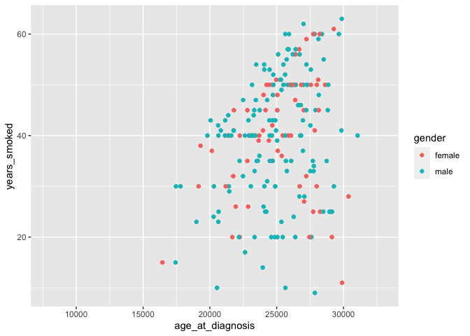
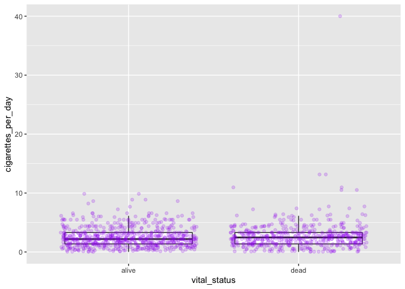
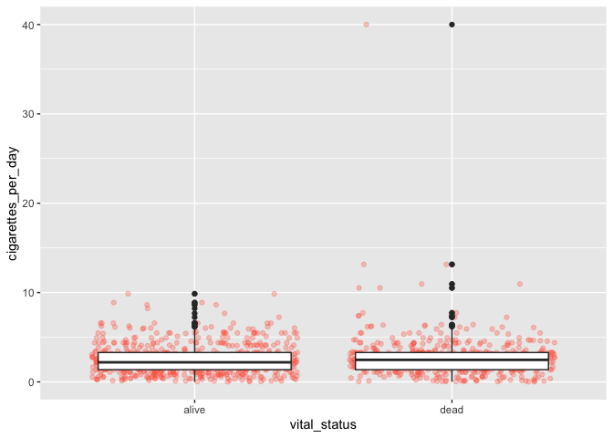
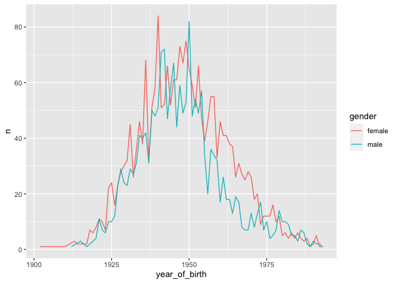
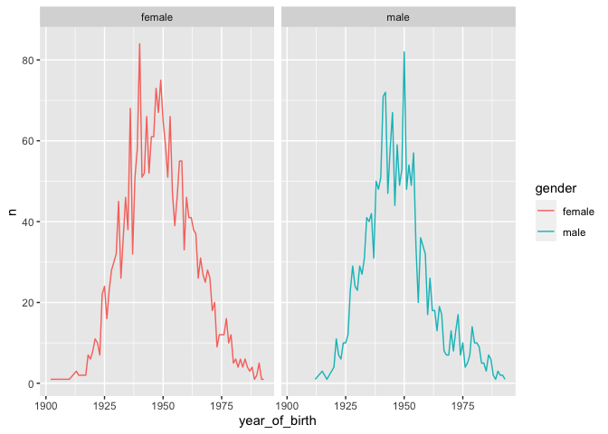
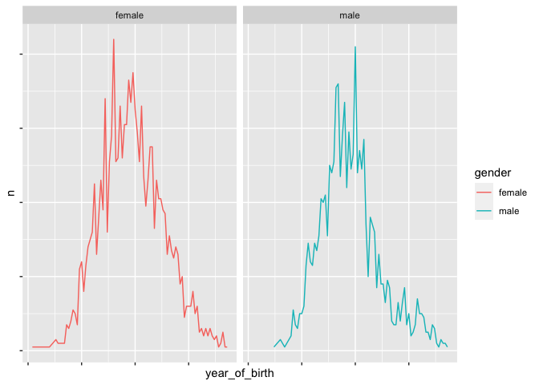

Introduction to R, Class 4: Solutions
================

<!--class4_solutions.md is generated from class4_solutions.Rmd. Please edit that file -->

## Challenge-scatterplot

``` r
ggplot(data=smoke_complete,
       aes(x=age_at_diagnosis, 
           y=years_smoked, color=gender)) +
  geom_point()
```

    ## Warning: Removed 730 rows containing missing values (geom_point).

<!-- -->

#### Challenge-comments

``` r
# assign data and aesthetics to object
my_plot <- ggplot(smoke_complete, aes(x = vital_status, y = cigarettes_per_day))
# start with data/aesthetics object
my_plot +
  # add geometry (boxplot)
  geom_boxplot(outlier.shape = NA) +
  # add jitter
  geom_jitter(alpha = 0.2, color = "purple")
```

<!-- -->

#### Challenge-order

Yes, the order matters.

``` r
ggplot(data=smoke_complete,
       aes(x=vital_status, y=cigarettes_per_day)) +
  geom_jitter(alpha=0.3, color="tomato") +
  geom_boxplot()
```

<!-- -->

#### Challenge-line

``` r
yearly_counts2 <- birth_reduced %>%
  count(year_of_birth, gender)
ggplot(data=yearly_counts2, 
       aes(x=year_of_birth, y=n, color=gender)) +
  geom_line(aes(color=gender))
```

<!-- -->

#### Challenge-dash

``` r
ggplot(data=yearly_counts2, 
       aes(x=year_of_birth, y=n, color=gender)) +
  geom_line(aes(linetype=gender))
```

<!-- -->

#### Challenge-panels

``` r
ggplot(data=yearly_counts2, 
       aes(x=year_of_birth, y=n, color=gender)) +
  geom_line() +
  facet_wrap(~gender)
```

<!-- -->

#### Challenge-axis

One possible search result
[here](http://www.sthda.com/english/wiki/ggplot2-axis-ticks-a-guide-to-customize-tick-marks-and-labels#set-the-position-of-tick-marks).

``` r
ggplot(data=yearly_counts2, 
       aes(x=year_of_birth, y=n, color=gender)) +
  geom_line() +
  theme(axis.text.x = element_blank(), # hide labels
    axis.text.y = element_blank()) +
  facet_wrap(~gender)
```

<!-- -->

## Extra exercises

#### Challenge-improve

There are lots of options for this answer\!
